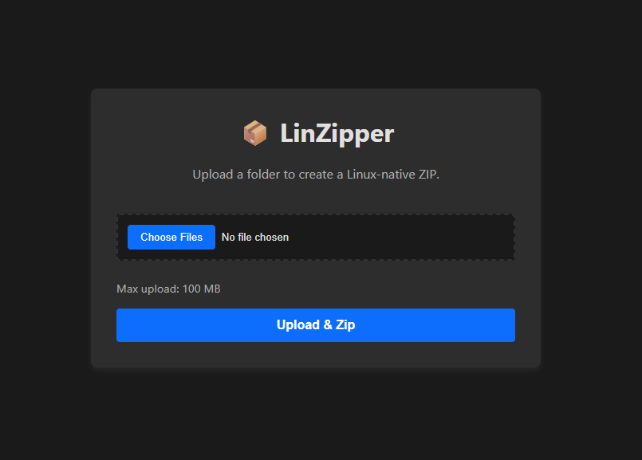

# LinZipper

Is this the easiest way to zip a folder? Probably not. Is it the most reliable way to avoid Windows-induced Firefox rejection? Also probably not, but at least it works.

LinZipper is a Dockerized utility designed to create ZIP archives with native Linux metadata.



## The Problem

While developing a browser extension, I found that ZIP archives created on Windows were often rejected during the Firefox extension validation process. After some research, I discovered this is because Linux-based environments require specific Unix file attributes and permissions that Windows-native zipping utilities do not consistently preserve.

## The Solution

LinZipper runs the zipping step inside a small Linux container. Upload a folder and it returns a ZIP that preserves Linux-native metadata so the archive works properly on Linux (and for use cases like browser extensions).

## 🚀 Usage

### Docker Compose (Recommended)

```bash
docker compose up --build
```

### Manual Docker Build

```bash
docker build -t linzipper .
docker run -p 5000:5000 linzipper
```

Navigate to http://localhost:5000 to upload and process folders.

## Configuration

Copy the example file and set any environment variables you want to change:

```bash
cp .env.example .env
# On Windows (PowerShell):
# copy .env.example .env
```

The service reads `MAX_CONTENT_MB` (megabytes) from the environment and uses it to set Flask's upload limit. The default in `.env.example` is `100` (100 MB). When using Docker Compose, the `.env` file is loaded automatically.

Recommended default: 100 MB is a sensible starting point for most uses; lower it if you only expect small uploads.

## 📂 Project Structure

```text
.
├── web/
│   ├── static/          # CSS and JS assets
│   ├── templates/       # HTML templates
│   └── app.py           # Flask backend
├── Dockerfile           # Alpine build configuration
├── docker-compose.yml   # Local deployment config
├── .gitattributes       # Enforces LF line endings for the repo
└── README.md
```

## 🛠️ Technical Specs

- **Base Image:** `python:3.12-alpine`
- **Tools:** Native `zip` packages.
- **Environment:** Fully containerized to isolate the filesystem from the host OS.

## Security & Hosting

**For Local Use Only: This tool is intended for personal development workflows. It is not hardened for production environments and should not be exposed to the public internet.**

## License

MIT